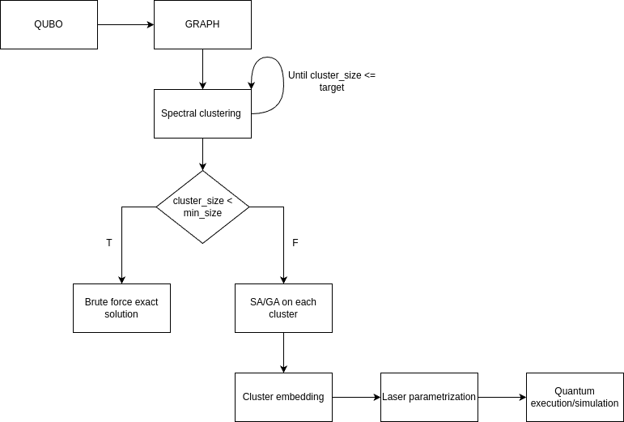
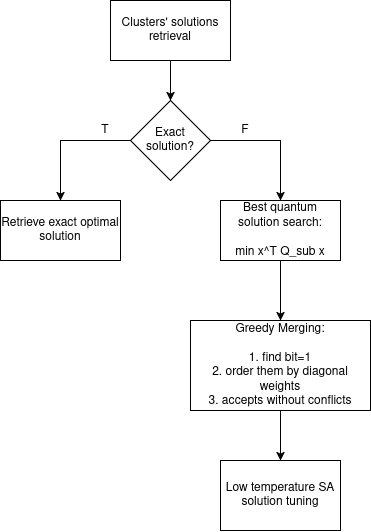

# Hybrid Quantum-Classical Architecture for Large-Scale QUBO Problems

This repository serves as the experimental foundation and prototyping sandbox for researching spatial embeddings of Quadratic Unconstrained Binary Optimization (QUBO) problems on Neutral Atom quantum architectures (specifically targeting Pasqal's *Jade* QPU constraints).

The codebase explores both monolithic heuristic embeddings (Genetic Algorithms and Simulated Annealing) and a novel distributed approach, the **Divide et Impera** architecture, designed to scale beyond current physical hardware limitations.

---

**Core Utility Scripts**
These scripts are used to generate and inspect the target mathematical instances:
*   `instance_generator.py`: Generates physically viable UDG (Unit Disk Graph) QUBO instances. To target neutral atom QPUs driven by a global laser, use the `generate_verisimilar_UDG_qubo` method with your desired geometric constraints.
*   `inspect_qubo.py`: Provides visual (console) and mathematical inspection of the generated QUBO matrices.

---

**The Baseline Pipeline (Monolithic)**
Found inside the `jade/` directory, these scripts handle the direct embedding of QUBO matrices onto continuous 2D spatial registers.
*   `bench-GA.py` / `bench-SA.py`: The core execution engines. Their workflow is as follows:
    1. Load the target QUBO instance.
    2. Optimize the spatial layout (using the recommended `improved_topological_mae` fitness function).
    3. Compile and send the adiabatic sequence to the remote Jülich HPC Analog Emulator (applying *Jade*'s strict physical constraints).
    4. Log execution metrics and parameters to a `.csv` file.
*   `retrieve.py`: The final step of the experimental loop. Insert the `Job_id` and the instance file path to retrieve the quantum measurement distribution. Successful ground-state identifications are automatically highlighted in green.

---

**The *Divide et Impera* Architecture**
To tackle massive matrices (e.g., 100x100), the repository includes partition-based approaches. The most mature and highly recommended pipeline relies on Simulated Annealing with greedy initialization (`bench-SA-partitioned-greedy-init.py`).

**1. Partitioning and Local Execution**
The global matrix is shattered into hardware-compliant sub-clusters via Spectral Clustering, embedded independently, and routed to the quantum emulator.

**2. Retrieval and Merging**
Execute `retrieval-merging.py` to retrieve the localized measurements, filter out quantum noise via exact local energy evaluation, and merge the states utilizing a deterministic greedy protocol followed by a low-temperature SA fine-tuning.

*(Note: Other scripts in the `jade/` folder represent experimental variants developed during the research phase. Feel free to explore them as conceptual sandboxes.)*

---

**Datasets (`my_QUBO_instances/`)**
Contains the UDG instances generated and tested during this research, ranging from small 5x5 matrices up to heavily saturated 100x100 graphs. 

**D-Wave Benchmarks (`D-wave/`)**
Includes lightweight scripts to benchmark instances using pure quantum and hybrid solvers on the D-Wave platform for analytical comparison.

---

**Contributing & Contact**
This is an active research repository. Every script is heavily commented to detail its algorithmic purpose (with occasional localized notes in Italian). I highly appreciate any constructive feedback, ideas, or questions. Feel free to open an issue or contact me directly to discuss quantum combinatorial optimization!

